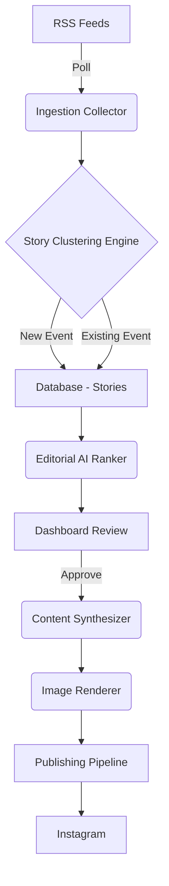

# 📰 CipherBrief

> **The fully autonomous, AI-driven newsroom that turns raw RSS feeds into production-ready Instagram stories.**

[](https://python.org)
[](https://opensource.org/licenses/MIT)
[](https://github.com/psf/black)

CipherBrief is a robust, end-to-end data pipeline and dashboard that autonomously ingests global news, uses AI to cluster and rank stories, synthesizes editorial captions, and renders stunning typographic images ready for social media publishing. 


---

## ✨ Features

- **📡 Multi-Source RSS Ingestion:** Continuously monitors BBC, Reuters, AP, CNN, DW, and more.
- **🧠 AI Story Clustering:** Detects when multiple outlets report on the same event and clusters them into a single, comprehensive "Story" instead of redundant articles.
- **⚖️ Editorial Ranking Engine:** Scores stories on virality, importance, and freshness to surface only the most critical global events.
- **🎨 Automated Asset Rendering:** Built-in Python/OpenCV renderer dynamically generates beautiful, branded, typographic Instagram-ready image posts.
- **📝 Automated Copywriting:** Uses LLMs to synthesize engaging captions and relevant hashtags.
- **📊 Streamlit Dashboard:** A production-grade UI for human-in-the-loop approval and live previewing.
- **🚀 One-Click Publishing:** Directly publishes approved stories to Instagram or exports them to GitHub Storage.

---

## 🏗️ Architecture




---

## 🚀 Quick Start

### 1. Clone the repository
```bash
git clone https://github.com/yourusername/CipherBrief.git
cd CipherBrief
```

### 2. Set up the environment
```bash
python -m venv venv
source venv/bin/activate  # On Windows: venv\Scripts\activate
pip install -r requirements.txt
```

### 3. Configure API Keys
```bash
cp .env.example .env
# Edit .env and add your OPENROUTER_API_KEY
```

### 4. Run the Ingestion Pipeline
```bash
python main.py
```

### 5. Launch the Dashboard
```bash
streamlit run app.py
```

---

## ⚙️ Configuration

| Variable | Description | Example |
|----------|-------------|---------|
| `OPENROUTER_API_KEY` | Required for AI clustering & captions | `sk-or-v1-...` |
| `DATABASE_NAME` | SQLite database file | `briefbot.db` |
| `INSTAGRAM_USERNAME` | (Optional) For direct publishing | `my_news_page` |
| `INSTAGRAM_PASSWORD` | (Optional) For direct publishing | `********` |

---

## 📂 Project Structure

```text
CipherBrief/
├── ai/                 # LLM integrations, clustering logic, and ranking
├── collectors/         # RSS feed parsers and data ingestion
├── database/           # SQLite schemas, migrations, and CRUD operations
├── designer/           # OpenCV/Pillow typographic image renderer
├── publisher/          # Export to GitHub Storage & Instagram
├── services/           # Core business logic (Storage, Queue, Publishing)
├── story_engine/       # Similarity detection and clustering algorithms
├── app.py              # Streamlit human-in-the-loop dashboard
├── main.py             # CLI pipeline entrypoint
└── requirements.txt    # Pinned dependencies
```

---

## 🛠️ Tech Stack
- **Backend:** Python 3.11, SQLAlchemy, SQLite
- **Frontend:** Streamlit
- **AI/LLM:** OpenRouter (GPT-4 / Claude / Llama)
- **Image Processing:** OpenCV, Pillow, Numpy
- **Data Collection:** Feedparser, Newspaper3k/4k

---

## 🗺️ Roadmap
- [ ] Add Docker support for one-command deployment
- [ ] Implement robust CI/CD pipeline via GitHub Actions
- [ ] Full suite of unit tests with `pytest`
- [ ] Support for video generation (Reels/TikTok)
- [ ] Add Multi-Language Translation support

---

## 🤝 Contributing
Contributions are welcome! Please see [CONTRIBUTING.md](CONTRIBUTING.md) for details on how to set up the development environment, run tests, and submit Pull Requests.

## 📄 License
This project is licensed under the [MIT License](LICENSE).
