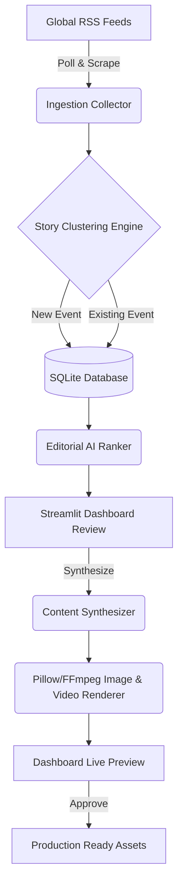

# 📰 CipherBrief AI Newsroom

> **An end-to-end autonomous AI newsroom that aggregates global news, synthesizes multi-source coverage using LLMs, and generates production-ready social media assets.**

[](https://python.org)
[](https://opensource.org/licenses/MIT)
[](https://github.com/psf/black)

CipherBrief is a robust data pipeline and dashboard that autonomously ingests global news, uses AI to cluster and rank stories, synthesizes editorial captions, and renders stunning typographic images and MP4 video reels ready for social media publishing.


---

## ✨ Engineering Highlights & Business Value

- **📡 Automated Data Ingestion:** Engineered a robust ingestion pipeline using RSS feeds and `BeautifulSoup` to scrape breaking news from 10+ global sources (BBC, Reuters, AP, NDTV, Hindustan Times, etc.). Includes custom web scrapers for extracting missing media assets (like `og:image` tags) when RSS feeds fall short.
- **🧠 AI-Powered Synthesis:** Integrated the OpenRouter LLM API to automatically cluster related stories, filter out noise, and synthesize multi-source reporting into concise, authoritative summaries.
- **⚖️ Algorithmic Scoring Engine:** Built a custom ranking algorithm that scores stories based on *importance, virality, freshness, and growth potential* to prioritize what gets published.
- **🎨 Dynamic Asset Generation:** Programmed a custom rendering engine using `Pillow (PIL)` and `FFmpeg` to dynamically composite high-resolution news photos, text, and cinematic gradients into pixel-perfect static images and 10-second MP4 video reels.
- **🎵 Audio Memory Manager:** Engineered an intelligent audio rotation system that dynamically mixes background music into generated video reels, keeping a historical state log to ensure tracks do not repeat for at least 12 cycles.
- **📊 Streamlit Control Panel:** Designed a responsive, state-managed dashboard using **Streamlit**, allowing human editors to review AI-generated posts, audit logs, and approve/reject content with a single click.

---

## 🏗️ Architecture




---

## 💡 Challenges Overcome

- **Handling inconsistent data sources:** RSS feeds often miss high-quality images. I engineered a robust fallback system that gracefully scrapes the original article's HTML meta tags (`og:image`) to retrieve the photo, or applies a dynamically generated branded fallback gradient if all else fails.
- **Ensuring strict JSON outputs from AI:** Wrote strict system prompts and retry-loops to ensure the LLM consistently returns structured JSON for the headlines, summaries, and exact hashtag counts, preventing pipeline crashes.
- **Transactional Asset Generation:** Designed a strict file-validation system that ensures all assets (images, captions, and hashtags) are successfully generated before a post is marked as "Ready", avoiding incomplete posts from ever reaching the dashboard.

---

## 🛠️ Tech Stack
- **Backend & Data:** Python 3.11, SQLAlchemy, SQLite, Feedparser, BeautifulSoup
- **Frontend / Deployment:** Streamlit, Streamlit Cloud
- **AI / Machine Learning:** OpenRouter API (DeepSeek/GPT models), Prompt Engineering
- **Asset Processing:** OpenCV, Pillow, Numpy, FFmpeg

---

## 🚀 Quick Start

### 1. Clone the repository
```bash
git clone https://github.com/mufasa027/BriefBot.git
cd BriefBot
```

### 2. Set up the environment
```bash
python -m venv venv
source venv/bin/activate  # On Windows: venv\Scripts\activate
pip install -r requirements.txt
```

### 3. Configure API Keys
```bash
cp .env.example .env
# Edit .env and add your OPENROUTER_API_KEY
```

### 4. Run the Ingestion Pipeline
```bash
python main.py
```

### 5. Launch the Dashboard
```bash
streamlit run app.py
```

### 6. (Optional) Enable Video Reels Audio
Drop royalty-free `.mp3` tracks into the `assets/audio/` directory. The engine will automatically detect them and mix them into your synthesized 10-second MP4 reels!

---

## 🤝 Contributing
Contributions are welcome! Please feel free to submit a Pull Request.

## 📄 License
This project is licensed under the [MIT License](LICENSE).
